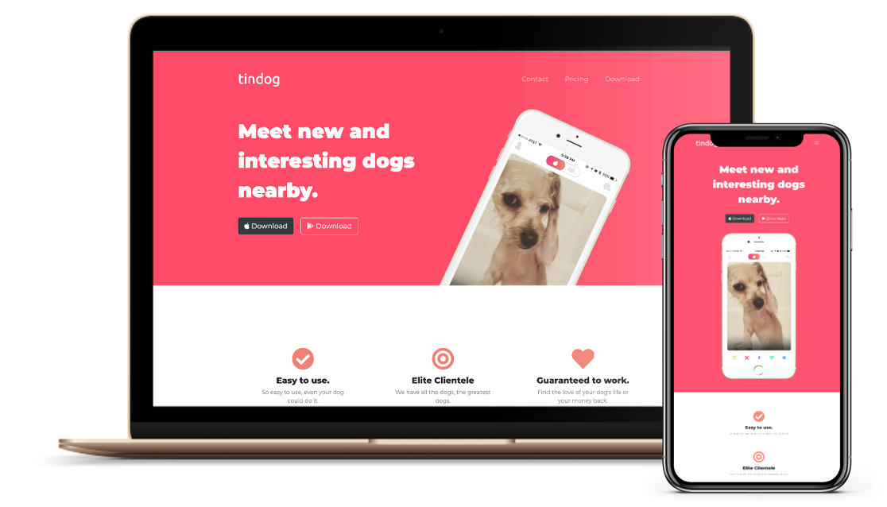

# TinDog

Project is part of the [Web Development Bootcamp](https://www.udemy.com/course/the-complete-web-development-bootcamp/), it was built using HTML, CSS and bootstrap to build this website.

    

  
  
  

#### 📝 Table of Contents

- [About](#about)
- [Getting Started](#getting_started)
- [Built Using](#built_using)

#### 🧐 About 

Write about 1-2 paragraphs describing the purpose of your project.

#### 🏁 Getting Started 

Clone the project and open the `index.html` file.

#### ⛏️ Built Using 

- [HTML](https://developer.mozilla.org/en-US/docs/Web/Guide/HTML/HTML5) 
- [CSS](https://www.w3.org/Style/CSS/current-work.en.html)
- [Bootstrap](https://getbootstrap.com/)
